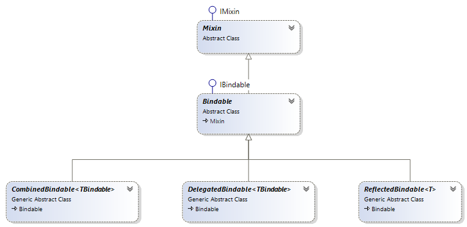
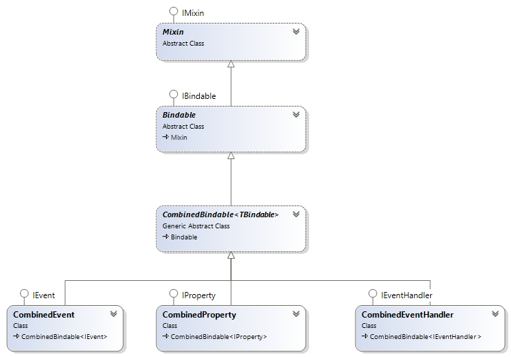
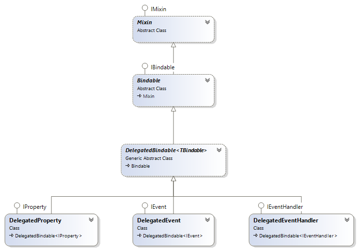
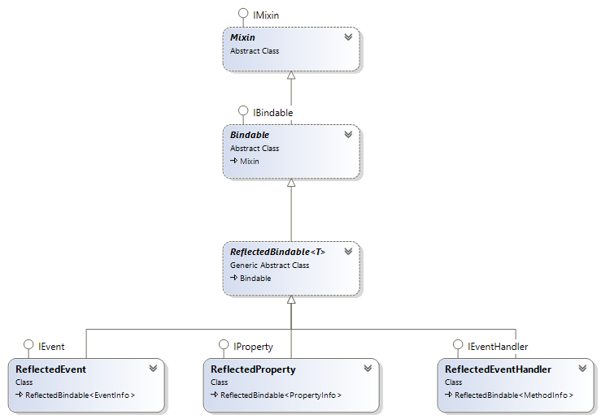

# Namespace: Bindable

In this namespace, you find four interfaces:

- **IBindable**    
  Represents a bindable property, event or method. The other interfaces inherit *IBindable*.
- **IEvent**    
  Bindable event.
- **IEventHandler**    
  Bindable event handler
- **IProperty**    
  Bindable property

These interfaces have been partially implemented with the class **Bindable** and the classes that 
inherit from that class.

## *Bindable* class 

## *CombinedBindable* class

## *DelegatedBindable* class

## *ReflectedBindable* class

